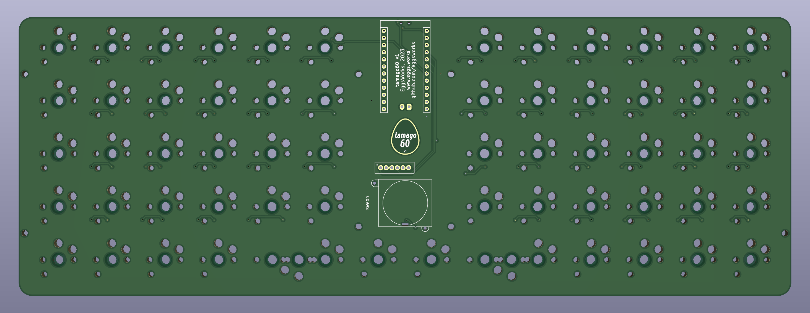

# tamago60

tamago60 is a hotswap, semi-split, low profile, ortholinear keyboard with a joystick in the middle.

## PCBWay

PCB prototyping for the tamago60 was kindly sponsored by [PCBWay](https://www.pcbway.com/). If you choose to build your own
tamago60, consider ordering from [PCBWay](https://www.pcbway.com/) to experience their fast turnaround, high quality production,
and excellent customer service. Thanks, PCBWay!

## Overview

We all love those laptops with the trackpoint in the middle of the keyboard, right? Influenced by that design,
with an ergo twist and a healthy dose of minimalism, the tamago60 is a roughly-60% board with a joystick
stuck between two semi-split ortho halves.

This design uses MX spacing (19mm) to allow flexibility with choice of keycaps. For the same reason, switches are
installed directly to the PCB rather than into a switchplate (DSA keycaps will crash into the plate if used with
Choc V2's).

## Components

- 60-64 Kailh Choc hotswap sockets
  - Depending on the keycaps you intend to use, you may need to install two switches in the 2u positions.
    If this is the case, only one is electrically connected and the other acts as a stabilizer. If your keycaps
    have the mounting position in the middle, you can just use the center position. Or, you can populate all three
    if you expect you might need to switch in the future.
- 60-62 Kailh Choc switches
  - Both original Choc and Choc V2 are supported.
- 61 SOD-123 SMD diodes (1N4148 or similar)
- 1 Pro Micro or compatible microcontroller module
- 1 K-Silver JP19 joystick module

A wireless build of this board has not yet been validated, but there are some features intended to improve quality-of-life
for any users who wish to try.

- Optional components for a wireless build:
  - 1 nice!nano, instead of the Pro Micro
  - 2 3216 SMD resistors (value can vary)
    - The intent of the resistors is to reduce the idle current drawn through the potentiometers of the joystick.
      If you are not doing a wireless build (or just don't care), populating 0 Ohm or simply bridging the contacts will suffice.
    - Too low resistance will increase idle power consumption, but two high may impact the ADC's ability to measure the
      joystick (e.g. 499k is too high).
  - 1 PCM12 SMD SPDT switch
    - This switch allows disconnecting the battery - if you don't care about the switch, but you still want to use the JST, you can
      bridge the pads intended for the switch.
  - 1 2-pin JST connector, if desired
    - If not using a JST connector for the battery, it can be soldered directly to the JST pads instead.
    - If using neither the the switch nor JST, you may as well attach the battery directly to the MCU module.

## Assembly

Prepare the back of the board with paste and place the SMT components:

- 61 diodes (cathode facing south)
- 60-64 sockets 
- Optionally, the two resistors

If you choose not to install the two resistors, you can simply bridge the pads intended for each.

Use your preferred heating method to reflow, then move on to the THT components on the front of the board:

- Install the MCU socket
- Install the joystick

That's all there is to it! Install your switches and keycaps, flash the firmware, and your board is ready to use.

## Firmware

Firmware is available from [our fork of QMK](https://github.com/eggsworks/qmk_firmware/tree/tamago60).

## License

This repository is available under the terms of the [GPL, verison 3](LICENSE).

Some portions are derived from:

- [keyswitches.pretty](https://github.com/daprice/keyswitches.pretty) ([CC BY-SA 4.0](https://creativecommons.org/licenses/by-sa/4.0/))
