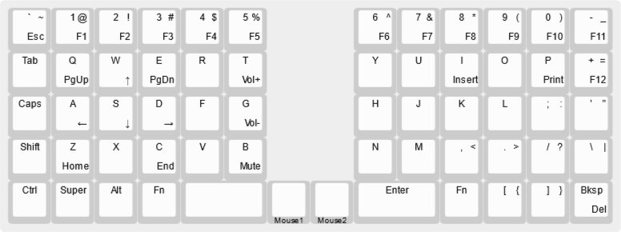

# tamago60

tamago60 is a hotswap, semi-split, low profile, ortholinear keyboard with a joystick in the middle.

## PCBWay

PCB prototyping for the tamago60 was kindly sponsored by [PCBWay](https://www.pcbway.com/). If you choose to build your own
tamago60, consider ordering from [PCBWay](https://www.pcbway.com/) to experience their fast turnaround, high quality production,
and excellent customer service. Thanks!

## Overview

We all love those laptops with the trackpoint in the middle of the keyboard, right? Influenced by that design,
with an ergo twist and a healthy dose of minimalism, the tamago60 is a roughly-60% board with a joystick
stuck between two semi-split ortho halves.

This design uses MX spacing (19mm) to allow flexibility with choice of keycaps. For the same reason, switches are
installed directly to the PCB rather than into a switchplate (DSA keycaps will crash into the plate if used with
Choc V2's).

## Components

- 60-62 Kailh Choc hotswap sockets
  - Depending on the keycaps you intend to use, you may need to install two switches in the 2u positions.
    If this is the case, only one is electrically connected, and the other acts as a stabilizer. If your keycaps
    have the mounting position in the middle, just use the center position.
- 60-62 Kailh Choc switches
  - Both original Choc and Choc V2 are supported.
- 60 SOD-123 SMD diodes (1N4148 or similar)
- 1 Pro Micro or compatible microcontroller module
- 1 K-Silver JP19 joystick module
- Optional components for a wireless build:
  - 1 nice!nano, instead of the Pro Micro
  - 2 3216 SMD resistors (value can vary, but 499k is recommended)
    - The intent of the resistors is to reduce the idle current drawn through the potentiometers of the joystick.
      If you are not doing a wireless build (or just don't care), populating 0 Ohm or simply bridging the contacts will suffice.
  - 1 PCM12 SMD SPDT switch
    - This switch allows disconnecting the battery - if you don't care, you can bridge those contacts together too.
  - 1 2-pin JST connector, if desired
    - If not using a JST connector for the battery, it can be soldered directly to the JST pads instead.
